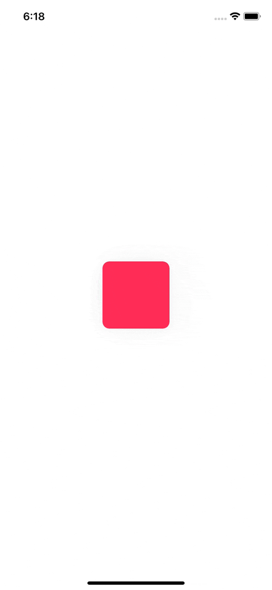

# ContextMenuAuxiliaryPreview

A library to add an auxiliary preview to the edge of the context menu preview.

* Support for programmatically showing the context menu.
* Preset transition for the aux. preview entrance/exit.
* Support for showing the aux. preview as a popover.


## Demo Gifs

TBA

<br><br>

## Installation

### Cocoapods

`ContextMenuAuxiliaryPreview` is available through [CocoaPods](https://cocoapods.org). To install it, simply add the following line to your `Podfile`:

```ruby
pod 'ContextMenuAuxiliaryPreview'
```

<br>

### Swift Package Manager (SPM)

Method: #1: Via Xcode GUI:

1. File > Swift Packages > Add Package Dependency
2. Add `https://github.com/dominicstop/ContextMenuAuxiliaryPreview.git`

<br>

Method: #2: Via `Package.swift`:

* Open your project's `Package.swift` file.
* Update `dependencies` in `Package.swift`, and add the following:

```swift
dependencies: [
  .package(url: "https://github.com/dominicstop/ContextMenuAuxiliaryPreview.git",
  .upToNextMajor(from: "0.3.0"))
]
```

<br><br>

## Basic Usage

[🔗 Full Example](./Example/Examples/AuxiliaryPreviewBasicUsage01Controller.swift)

```swift
// ✨ Some code ommmitted for brevity

import UIKit
import ContextMenuAuxiliaryPreview

class AuxiliaryPreviewBasicUsage01Controller: UIViewController, ContextMenuManagerDelegate {

  var interaction: UIContextMenuInteraction?;
  var contextMenuManager: ContextMenuManager?;

  override func viewDidLoad() {
    super.viewDidLoad()
    self.view.backgroundColor = .white;
    
    let boxView: UIView = {
      let view = UIView();
      view.backgroundColor = .systemPink;
      view.layer.cornerRadius = 10;
      
      let interaction = UIContextMenuInteraction(delegate: self);
      self.interaction = interaction;
      
      view.addInteraction(interaction);
      
      let contextMenuManager = ContextMenuManager(
        contextMenuInteraction: interaction,
        menuTargetView: self.view
      );
      
      self.contextMenuManager = contextMenuManager;
      contextMenuManager.delegate = self;
      
      contextMenuManager.auxiliaryPreviewConfig = AuxiliaryPreviewConfig(
        verticalAnchorPosition: .automatic,
        horizontalAlignment: .targetCenter,
        preferredWidth: .constant(100),
        preferredHeight: .constant(100),
        marginInner: 10,
        marginOuter: 10,
        transitionConfigEntrance: .syncedToMenuEntranceTransition(),
        transitionExitPreset: .fade
      );

      return view;
    }();
    
    boxView.translatesAutoresizingMaskIntoConstraints = false;
    self.view.addSubview(boxView);
    
    NSLayoutConstraint.activate([
      boxView.centerXAnchor.constraint(
        equalTo: self.view.centerXAnchor
      ),
      boxView.centerYAnchor.constraint(
        equalTo: self.view.centerYAnchor
      ),
      boxView.widthAnchor.constraint(
        equalToConstant: 100
      ),
      boxView.heightAnchor.constraint(
        equalToConstant: 100
      ),
    ]);
  };
};

extension AuxiliaryPreviewBasicUsage01Controller: UIContextMenuInteractionDelegate {

  func contextMenuInteraction(
    _ interaction: UIContextMenuInteraction,
    configurationForMenuAtLocation location: CGPoint
  ) -> UIContextMenuConfiguration? {
  
    self.contextMenuManager!.notifyOnContextMenuInteraction(
      interaction,
      configurationForMenuAtLocation: location
    );
    
    return UIContextMenuConfiguration(identifier: nil, previewProvider: nil) { _ -> UIMenu? in
      let shareAction = UIAction(
        title: "Share",
        image: UIImage(systemName: "square.and.arrow.up")
      ) { _ in
        // no-op
      };
      
      return UIMenu(title: "", children: [shareAction]);
    };
  };
  
  func contextMenuInteraction(
    _ interaction: UIContextMenuInteraction,
    willDisplayMenuFor configuration: UIContextMenuConfiguration,
    animator: UIContextMenuInteractionAnimating?
  ) {
    
    self.contextMenuManager!.notifyOnContextMenuInteraction(
      interaction,
      willDisplayMenuFor: configuration,
      animator: animator
    );
  };
  
  func contextMenuInteraction(
    _ interaction: UIContextMenuInteraction,
    willEndFor configuration: UIContextMenuConfiguration,
    animator: UIContextMenuInteractionAnimating?
  ) {
    
    self.contextMenuManager!.notifyOnContextMenuInteraction(
      interaction,
      willEndFor: configuration,
      animator: animator
    );
  };
  
  func onRequestMenuAuxiliaryPreview(sender: ContextMenuManager) -> UIView? {
    let menuAuxiliaryPreview = UIView(frame: .zero);
    menuAuxiliaryPreview.backgroundColor = .red;
    
    return menuAuxiliaryPreview;
  };
};

```

